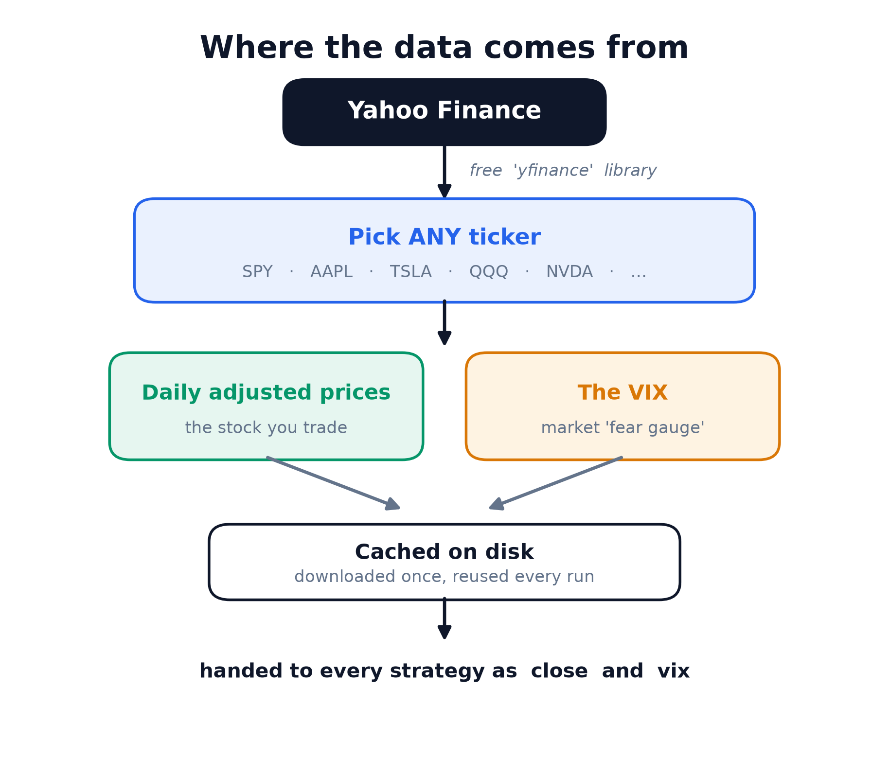
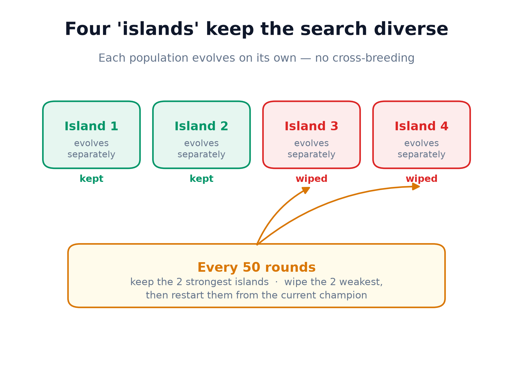
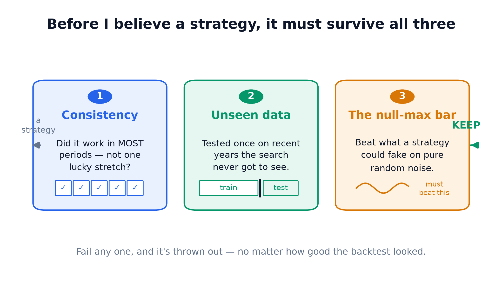

# 🧬 Teach Your LLM to Trade Any Stock

### An LLM breeds trading strategies. A deliberately paranoid engine decides whether they're real.

*Point it at any ticker on Yahoo Finance — Apple, Tesla, an index fund — and it evolves a trading strategy for it. The hard part was never finding a strategy that looks good. It's refusing to believe a bad one. This repo is mostly about the refusing.*

There's a seductive idea floating around: point a large language model at market data, ask it for a winning trading strategy, and get rich. It doesn't work, and the reason it doesn't work is the same reason most quant research fails — not because the models are dumb, but because **searching hard for a great-looking result is a machine for manufacturing lies.**

So I built something more careful. It's based on DeepMind's *FunSearch*, and it treats the language model not as an oracle that knows the market, but as a **tireless idea generator** inside an evolutionary loop. The model never sees a single price. It only ever sees *code* — other people's strategies — and its one job is to write a better one. Then a deliberately paranoid scoring engine decides whether "better" is real or just noise wearing a nice costume.

Here's the whole thing, in plain English.

## The big idea in one picture


That's it. It's breeding. Good strategies get to be "parents" more often, their traits get combined and mutated by the model, and over thousands of rounds the population climbs toward strategies that work — the same way animal breeding produces a better sheepdog without anyone designing one from scratch.

## Where the data comes from

Everything runs on **free public data from Yahoo Finance**, pulled with an open-source Python library called `yfinance`. You give it a ticker symbol; it hands back the daily price history.



A few things worth knowing:

- **It's not limited to the S&P 500.** Change one word — the ticker — and the exact same search runs on Apple, Tesla, a gold ETF, whatever Yahoo lists. The stock you name is the thing the strategies buy and sell.
- **Prices are adjusted** for splits and dividends, so a stock split doesn't look like a crash.
- **The VIX comes along for the ride.** The VIX is the market's "fear gauge" — it spikes when investors panic. Even when you're trading a single stock, knowing whether the whole market is calm or terrified is useful context, so every strategy can look at it.
- **It's cached.** The first run downloads the history; every run after that reads it off disk, so you're not hammering Yahoo.

The strategies themselves are small, readable programs. Here's the starting seed — a classic "ride the uptrend" rule:

```python
def strategy(data, tools):
    close = data["close"]
    fast = tools.sma(close, 50)      # short-term trend
    slow = tools.sma(close, 200)     # long-term trend
    signal = (fast > slow)           # be invested when the trend is up
    return signal
```

The language model can only build strategies out of a fixed toolbox of **safe, legitimate indicators** — moving averages, momentum, RSI, volatility measures, breakout levels, VIX regimes. It can't import anything weird, and — critically — it **can't peek at the future.** Every tool only looks backward. This keeps the search honest and inside the space of things a real trader could actually do.

## Why four "islands"?

If you keep one big population, it collapses. The first strategy that looks slightly better than the rest gets bred the most, its children take over, and within a few dozen rounds everything in the pool is a minor variation of one idea. You've locked onto the first okay answer and thrown away every other possibility.

The fix is to run **four separate populations — "islands" — that evolve independently.**



They all start identical, then drift apart, each wandering into a different corner of strategy-space. Every so often I'm ruthless: the two weakest islands get wiped and restarted from the best strategy found anywhere. So half the search keeps refining the current leader, and half keeps exploring fresh ground. A slow-blooming idea in island 3 gets room to mature instead of being out-competed to death in round twelve. Four is a deliberate, modest number — enough variety to matter, not so much that the search spreads too thin.

## The paranoid part: how not to fool yourself

This is the half that matters, and the half almost everyone skips. Anyone can produce a strategy that looks spectacular on past data. It will also lose money for real. The entire craft is telling those two apart — so every strategy has to survive a three-part gauntlet before I'll believe it.



**Test 1 — Consistency.** Instead of scoring a strategy on its overall track record, I chop the history into five time blocks and reward strategies that did well in *most* of them. A strategy that made all its money in one lucky year scores badly. One that was reliably decent across booms, busts, and calm years survives.

**Test 2 — Unseen data.** The most recent chunk of history is walled off. The search never touches it. The winner is tested on it exactly once, at the very end. If it looked brilliant on the old data and falls apart on the new data, that gap *is* the overfitting, and there's no hiding it.

**Test 3 — The null-max bar.** This is the subtle killer, and my favorite part. Even a strategy that passes the first two tests might just be the luckiest of the thousands I tried. So I ask: *how good could a strategy look on pure noise?* I take the real prices and **scramble them into randomness** — flip each day's move like a coin — then measure the best result my search can squeeze out of that nonsense. That's the "null-max bar." If my real winner can't clearly beat the score achievable on random noise, it gets rejected. Full stop.

The clever bit: this measures how *creative and flexible* my search is (a more powerful search can fit more nonsense, so it has to clear a higher bar), rather than the usual method of just counting how many strategies I tried — which perversely rewards you for looking at *fewer* ideas. Here, there's no reward for cutting corners.

You need all three. None replaces another. Consistency without the unseen-data wall and the noise bar just ships a well-dressed mistake.

## Running it — including on your favorite stock

Because it works on any ticker, using it is a one-liner. Point it at an index:

```
run the search on SPY
```

…or a single company:

```
run the search on AAPL
```

Under the hood it's the same loop: pull the data, breed strategies for a few hundred rounds, run the winner through the three-part gauntlet, and report back in plain language — *here's the best strategy, here's how it did on data it had never seen, here's the noise bar, and here's the verdict: keep it, or throw it out.* It's built to be blunt. A great-looking backtest that fails the gauntlet is not a discovery, and the system says so to your face.

**One honest note about individual stocks.** A single company is riskier ground than a broad index. It has less history (a company that IPO'd in 2020 gives the search far less to learn from), and it lurches on earnings and news in ways the S&P 500 smooths out. So on a single name, those last two tests — unseen data and the noise bar — matter *more*, not less. The engine runs happily on one stock; it just gets more skeptical, as it should.

## The honest bottom line

This does not print money. What it does is automate the *search* for trading ideas while making it structurally hard to lie to yourself about them — which is the real bottleneck in this work, not coming up with ideas. A "pass" here means *worth watching forward on paper*, not *bet the house*. There's no trading-cost realism beyond a simple fee, no borrowing costs — add those before you trust any number.

But that's the whole philosophy. The language model is a brilliant, tireless intern who proposes ten thousand strategies and never gets bored or attached to any of them. The engine's job — my job — is to be the grizzled advisor who refuses to be impressed by a pretty chart.

---

## Try it yourself

```bash
pip install -r requirements.txt
export ANTHROPIC_API_KEY=sk-ant-...

python run.py --ticker SPY  --iterations 300      # an index ETF
python run.py --ticker AAPL --iterations 300      # a single company
python run.py --ticker QQQ  --start 2010-01-01    # pick your window
```

`--ticker` takes any Yahoo Finance symbol. A ~300-round run makes ~300 cheap Haiku calls
(a few dollars). It prints a report and saves the full result to `runs/run_<TICKER>_*.json`.

Prefer to drive it from Claude? The whole search is wrapped as a **Claude Code subagent**
in `.claude/agents/funsearch-alpha.md`. The inner mutation loop stays as thousands of
direct API calls (you'd never want a heavyweight agent per mutation); the subagent is the
outer supervisor that launches the run, reads the result, and reports the verdict. Run
`claude` from this folder (or copy the file to `~/.claude/agents/`) and say:

> Use the funsearch-alpha subagent to run a 500-round search on TSLA.

## What's in the repo

| file | role |
|---|---|
| `alpha_tools.py` | the fixed, look-ahead-safe indicator library strategies may use |
| `data.py` | any Yahoo Finance ticker + the VIX, cached to disk |
| `strategy_seed.py` | the evolvable `strategy(data, tools)` contract + seed |
| `prompt.py` | the mutation prompt: two parent strategies → one improved child |
| `backtest.py` | the backtest, the block-CV objective, and the null-max-bar gate |
| `evolve.py` | islands, parent sampling, the LLM mutation call, evaluation |
| `run.py` | orchestration: `run_search(...)` and the CLI |
| `make_diagrams.py` | regenerates the diagrams in `assets/` |
| `.claude/agents/funsearch-alpha.md` | the Claude Code subagent wrapper |

## Honest limitations (read before trusting any number)

- **This is not investment advice and it does not print money.** A "pass" means *worth
  paper-trading forward*, not *deploy capital*.
- **Costs are a flat per-trade fee** — no slippage, borrow, or financing model. Add realism
  before believing a Sharpe.
- **It runs LLM-written code with `exec()`** on your machine. The builtin surface is
  restricted, but it is a speed bump, not a sandbox — run only code you can inspect.
- **Single names are noisier than indices** — less history, earnings gaps. The skeptical
  tests matter more there, not less.

## License

MIT — see [`LICENSE`](LICENSE).

