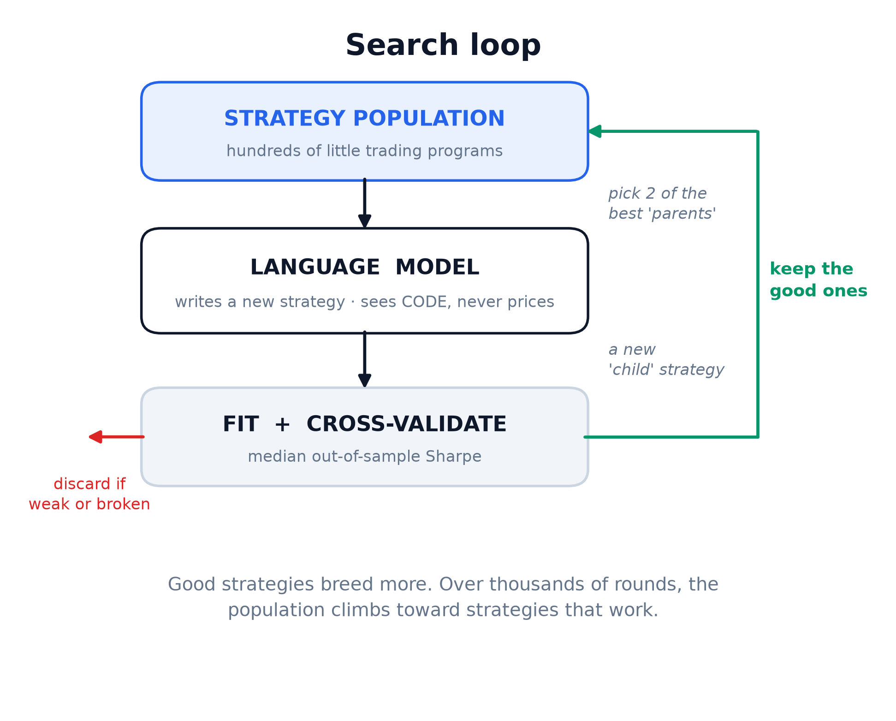

# LLM-Assisted Trading Strategy Search (LATSS)

**LATSS** places an LLM inside an evolutionary loop: it proposes and mutates trading-strategy **code**, a numerical optimizer fits the parameters, and a cross-validation + null-test framework decides whether any of it survives out of sample. It's a FunSearch-style search adapted to noisy financial data, with the LLM handling structural invention and the surrounding machinery doing the fitting, backtesting, and judging.

**📄 Full write-up:** [LLM-Assisted Trading Strategy Search](https://vincentmayeski.substack.com/p/llm-assisted-trading-strategy-search)



## What it does

- An LLM acts as the **mutation operator**, rewriting strategy structure. It never sees market data and never picks a numeric value.
- Each candidate declares free parameters; SciPy `differential_evolution` **fits** them on the training quarters of each split.
- Fitness is the **median out-of-sample outperformance of buy-and-hold** over random quarter cross-validation splits — scored on the *active return* (strategy minus buy-and-hold), so merely holding the asset scores 0 (default for single stocks; `--no-vs-buyhold` scores raw returns for assets with no long drift). Each candidate also gets a **report-only skill p-value** — a selection-aware *shift-the-signal* permutation test on the same active return (is the outperformance real, or a lucky re-timing of its own positions?). The holdout years are sealed and measured once against buy-and-hold.
- The objective is switchable: Sharpe, or return under a Sharpe floor; and with leverage enabled, strategies can lever up to beat buy-and-hold on return. A single population with a periodic cull replaces the old islands (the mutation prompt uses the whole scored history; see PIPELINE.md §11).
- The mutation model is pluggable: a local open model (Ollama), any OpenAI-compatible endpoint, the Anthropic API, or a Claude Code subagent.

The [article](https://vincentmayeski.substack.com/p/llm-assisted-trading-strategy-search) covers the method in full, a worked NVDA example, and how it relates to FunSearch, AlphaEvolve, MadEvolve, and QuantEvolve.

## Quick start

Local model, no API key:

```bash
brew install ollama
ollama serve                       # leave running
ollama pull qwen2.5-coder:7b

pip install -r requirements.txt
export LLM_BASE_URL=http://localhost:11434/v1
export LLM_MODEL=qwen2.5-coder:7b
python run.py --ticker NVDA --start 2017-01-01 --iterations 300
```

- **Hosted model:** unset `LLM_*` and set `ANTHROPIC_API_KEY`, or point `LLM_BASE_URL` / `LLM_MODEL` at any OpenAI-compatible provider (e.g. Groq).
- **Claude Code subagent:** `LLM_PROVIDER=subagent`.
- **Maximize return under a Sharpe floor:** add `--objective return --min-sharpe 0.8`.
- **Set your own transaction cost:** `--cost 0.001` (default `0.0005` = 5 bps per unit of turnover; `--cost 0` for frictionless). Applies to the search, the CV fitness, and the sealed holdout.

Progress streams to `runs/<TICKER>_progress.log`. The champion code, its median OOS fitness, its shift-the-signal skill p-value, and the sealed-holdout numbers vs buy-and-hold land in `runs/run_<TICKER>_*.json`.

## Worked example: NVDA

This is a concrete run — what the search produced, how it reads against buy-and-hold in-sample and out of sample, and the two things it teaches about evaluating these strategies.

**The search command** (2017-2024 searched; 2025-2026 sealed and measured once):

```bash
LLM_PROVIDER=subagent python run.py --ticker NVDA \
  --holdout-year 2025 --iterations 200 --reset-every 25 \
  --objective sharpe --max-leverage 2 --train-frac 0.5 \
  --skill-gate --skill-pmax 0.15 --jobs 4
```

**The champion** the LLM wrote: a rolling percentile-rank / vol-regime switch. In a *calm* regime it levers by position-in-range (1.0 → 1.7 → 2.0× as price climbs its own range); in a *wild* regime it shorts only an *established* breakdown (price stuck at the bottom of its range for the whole lookback, not a one-bar wick). It passes the shift-the-signal skill test at p = 0.033 and averages 1.48× exposure. Full code + fitted params are in [`examples/nvda_worked_example.py`](examples/nvda_worked_example.py).

Reproduce every number below with:

```bash
python examples/nvda_worked_example.py
```

`active-Sh` is the Sharpe of the *active return* (strategy − buy&hold) — the information ratio, and the quantity the fitness maximizes. B&H scores 0 on it by construction.

**In-sample (2017-2024):**

| period | strategy | buy & hold | active-Sh |
|---|---|---|---|
| **full pool** | +144,861% · Sh 1.60 · DD 65% · MAR 2.29 | +5,241% · Sh 1.24 · DD 66% · MAR 0.97 | **+1.43** |
| 2018 | **+32.5%** · Sh 0.77 | **−30.8%** · Sh −0.50 | +1.21 |
| 2022 | −51.2% · Sh −0.66 | −50.3% · Sh −0.80 | +0.08 |
| 2023 | +614.6% · Sh 2.65 | +239.0% · Sh 2.78 | +2.38 |

Higher return every year, positive active-Sharpe every year. But the edge is concentrated in the bull years (leverage compounding), with one genuine defensive save (2018: +32.5% while B&H lost 30.8%) and essentially **no protection in the real crash** (2022: −51% vs −50%).

**Out-of-sample (sealed holdout):**

| period | strategy | buy & hold | active-Sh |
|---|---|---|---|
| 2025 | +40.5% · Sh 0.85 · DD 51% · MAR 0.80 | +38.9% · Sh 0.92 · DD 37% · MAR 1.07 | **+0.37** |
| 2026 (thru Aug) | +21.6% · Sh 0.84 · DD 28% · MAR 1.37 | +16.8% · Sh 0.86 · DD 19% · MAR 1.52 | **+0.68** |
| 2025+26 | +70.8% · Sh 0.85 · DD 51% · MAR 0.79 | +62.2% · Sh 0.89 · DD 37% · MAR 0.96 | **+0.46** |

### Lesson 1 — "beat buy-and-hold on return" ≠ "beat it on Sharpe"

The goal here was a strategy with a **healthy standalone Sharpe (≥ ~0.8) that beats buy-and-hold on *return*** — not one that beats buy-and-hold's *Sharpe*. The champion does exactly that: out of sample it beats B&H on **total return** (+70.8% vs +62.2%) and on **active Sharpe** (+0.46, positive in both years), while its standalone Sharpe stays healthy (0.85 > 0.8). But because it runs 1.48× leverage, its drawdowns are deeper (51% vs 37%) so its **standalone Sharpe and MAR are *worse* than simply holding NVDA**. That is the intended trade, not a bug — but it means a risk-averse holder who indexes on Sharpe or drawdown would still prefer B&H. Beating a benchmark on return is a genuinely different claim from dominating it on risk; this framework lets you ask for either.

> Note on objectives: this run used `--objective sharpe`, which maximizes the *active* Sharpe (information ratio) — reward for consistent outperformance, not for raw exposure. To literally optimize "maximize return subject to a Sharpe floor," use `--objective return --min-sharpe 0.8` instead.

### Lesson 2 — the CV split ratio changes what the search overfits to

An earlier version of this run used the default **75/25** quarter split (fit on 75% of quarters, test on 25%). It converged on a *different*, more aggressive champion (levered SMA dip-buying, 1.58×) that scored **+1.13 in-sample and −0.44 out of sample** — its in-sample active-Sharpe did not carry over to the holdout years. Random-quarter CV holds out quarters from the *same* 2017-2024 bull regime it trains on, so it certifies within-regime generalization and is blind to a regime shift; tightening the ratio to **50/50** did not lower the achievable in-sample score (~+1.09 either way), but it changed the fitness landscape enough that the search found the more robust structure above, which *did* keep a positive active-Sharpe out of sample. The split ratio is not a knob that detects overfitting — but it does steer *which* structure the search settles on. Genuinely detecting regime-overfit needs a **forward-block or cross-asset** holdout, not a reshuffle of the same years.

**Bottom line:** out of sample this champion does **not** outperform buy-and-hold significantly — it is *worse* on Sharpe (0.85 vs 0.89) and MAR (0.79 vs 0.96), and only slightly ahead on return (+70.8% vs +62.2%). That is an encouraging result for the point of this exercise, which was to test the concept and the pipeline end-to-end — not to find a profitable strategy. This is a test example only, not a recommendation to trade this or any particular strategy.

## Layout

| file | role |
|---|---|
| `alpha_tools.py` | fixed, causal indicator library available to strategies |
| `strategy_seed.py` | the trainable `param_space()` + `strategy(data, tools, p)` contract and seeds |
| `prompt.py` | the mutation prompt (whole scored history → one child) |
| `backtest.py` | backtest, differential-evolution fit, quarter-CV median-OOS fitness, shift-the-signal skill test |
| `evolve.py` | single population + periodic cull, mutation call, evaluation, skill p-value/gate, repair/self-correct |
| `run.py` | orchestration: `run_search(...)` and CLI |
| `llm.py` | provider shim: Ollama / OpenAI-compatible / Anthropic / Claude Code subagent |
| `data.py` | Yahoo Finance price data (any ticker), cached to disk |
| `params.py` | encodes `param_space()` into the optimizer's search box |
| `examples/nvda_worked_example.py` | reproduce the worked-example tables (in-sample + sealed holdout vs buy-and-hold) |

## Notes

Not investment advice. This is a research prototype: transaction costs are a flat per-trade fee, and the evaluation is a single held-out window. See the article's limitations and future-work sections.

## License

MIT — see [`LICENSE`](LICENSE).
