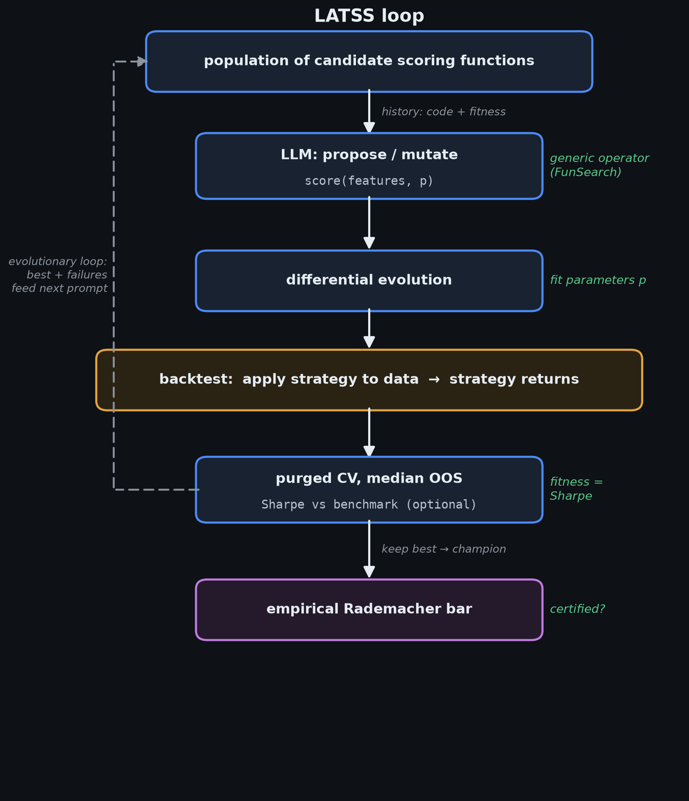
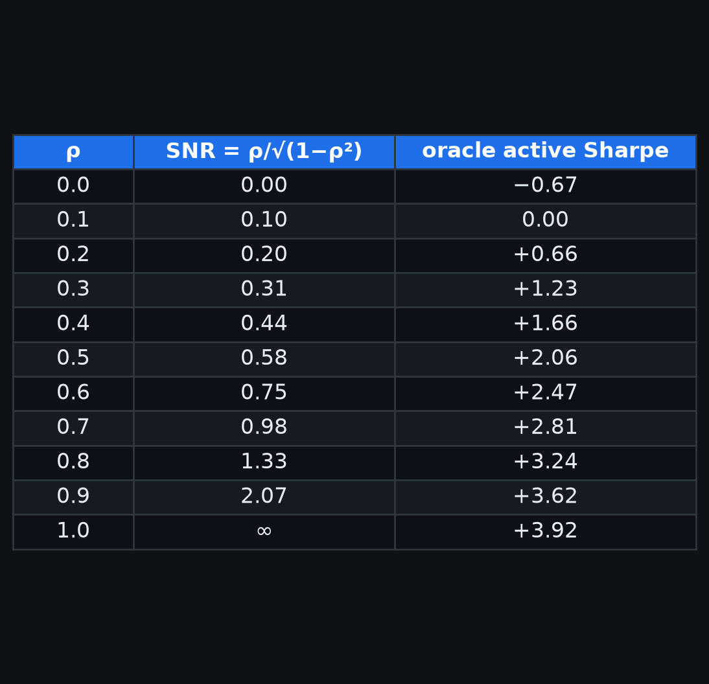
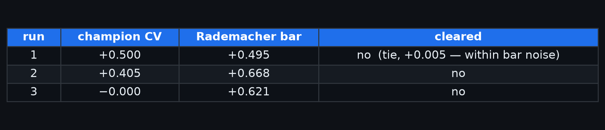
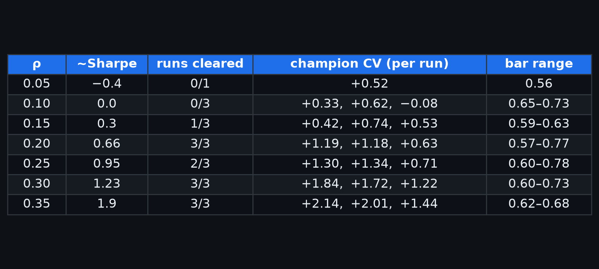

# Using AI in Trading Strategy Development: the AI Quant Agent

LATSS — **L**LM-**A**ssisted **T**rading **S**trategy **S**earch — is an AI quant agent: it
does the work a quantitative analyst does when searching for alpha. A quant invents a
strategy structure, fits its parameters, backtests it out-of-sample, and judges whether the
edge is real or an artifact of overfitting. LATSS runs that same loop automatically — a
language model proposes and mutates the strategies, and deterministic components fit the
parameters and validate the result.

One thing it cannot do is **invent genuinely new alpha**. Like a coding agent, LATSS
recombines and rigorously tests ideas from a human-supplied vocabulary of features under
supervision; it does not conjure a new predictive idea or market mechanism from nothing. That
creative leap — abduction, the "jump" to a hypothesis outside what the model has seen — is a
capability today's LLMs lack, and no agent or framework adds it: it would require a change in
the model itself, not better orchestration. (Developed at the end — see *Where more research
is needed: generating the alpha*.)

Each section below states the experiment, how it is set up, and what it is designed to show.
Measured results are in the Results section at the end. The full code — the loop, the skill
bars, the cross-validation, and the synthetic test-bed — is open source at
[github.com/vincent212/llm-assisted-trading-strategy-search](https://github.com/vincent212/llm-assisted-trading-strategy-search).

## Introduction

Large language models can write trading-strategy code fluently, but they cannot trade:
they have no reliable way to tell a genuine market effect from a pattern that merely looks
good in historical data. An LLM proposes strategies; it cannot tell whether they work.
LATSS resolves this with a division of labor — the LLM is used as a *search operator*, not
a predictor. It proposes and mutates strategy *structure*, while separate deterministic
components fit the numerical parameters and decide whether a candidate survives.

This follows DeepMind's **FunSearch** (2023), which established the template: an LLM
proposes programs, a systematic evaluator scores them, and the best feed back into the next
prompt — a search over "function space," with the LLM acting as a mutation operator inside
an evolutionary loop. FunSearch found novel results in combinatorics and optimization;
related systems (AlphaEvolve, MadEvolve, QuantEvolve) apply the same pattern elsewhere.
LATSS adapts FunSearch to trading, whose scoring landscape is far noisier and easier to
overfit than FunSearch's exact-score problems. It keeps the propose → score → feed-back
loop but adds the safeguards trading demands: parameter fitting is split out into
differential evolution (separate from structure design), and FunSearch's single exact score
is replaced by cross-validated out-of-sample active Sharpe plus an empirical skill bar that
filters strategies which could look good by luck alone.

Because the LLM can only combine the features it is given, the feature vocabulary defines
the entire discoverable strategy space — curating it is where human market insight enters.
This document validates the *loop as an instrument* — whether it recovers real signal and
rejects noise — not any particular strategy.

## Two use cases of LATSS

LATSS is used in two ways.

1. **Generative — turn indicators into a strategy.** Given a set of candidate alpha
   indicators, run the loop to search for a scoring rule that combines them into a
   selection strategy. The search overfits, so a champion is trustworthy only if its
   cross-validated active Sharpe clears the skill bar; and even then an unconstrained
   search can clear the empirical bar on noise, so the bar is necessary but not sufficient.

2. **Diagnostic — test one candidate indicator.** When developing a single alpha
   indicator, hand LATSS that indicator together with a set of null (noise) predictors and
   withhold which is which. If the loop selects the candidate over the nulls and its
   champion clears the bar, that is evidence the candidate carries real signal. The
   diagnostic is conclusive only in the paired form — the candidate among nulls clears the
   bar with headroom while nulls alone do not. Caveat: at low signal strength the loop
   overfits the nulls instead of finding the candidate, so a single clear is not proof —
   the candidate must be recovered and certified across seeds.

## LATSS architecture (generic)

LATSS (LLM-Assisted Trading Strategy Search) searches for a trading strategy expressed as a
function of features — the object a quant otherwise hand-designs. Nothing in this section is
tied to a particular market, instrument, or strategy form:

1. **Strategy representation.** A candidate is a scoring function `score(features, p)` that
   maps features to a trading decision, with numeric parameters p.
2. **Search.** A language model proposes and mutates the scoring function — the LLM as
   mutation operator, following FunSearch; differential evolution then fits its parameters p.
3. **Fitness / selection.** Each candidate is backtested and scored by its cross-validated
   median out-of-sample Sharpe, measured against an **optional benchmark** — the passive
   alternative for the use case. Trading a single instrument, the benchmark is buy-and-hold
   of that instrument (a strategy timing NVDA is scored against just holding NVDA); selecting
   from a universe, it is the equal-weight portfolio (scored against holding every name
   equally); for a self-funding strategy with no passive alternative — an FX delta-one or
   market-neutral book — there is no benchmark and the fitness is the strategy's own Sharpe.
   So fitness = Sharpe of (strategy return − benchmark return), and with no benchmark that is
   just the strategy's absolute Sharpe. The loop keeps the highest-fitness candidate (the
   champion).
4. **Certification.** The champion is credited with skill only if its active Sharpe clears
   a skill bar (the empirical Rademacher bar).

The loop repeats propose → fit → score for a fixed number of iterations; the champion is
the highest-fitness candidate seen.

## The Magnificent-7 experiment

The generic loop is instantiated on a concrete market to test it:

- **Universe:** the seven "Magnificent-7" US equities (AAPL, MSFT, GOOGL, AMZN, NVDA, META,
  TSLA). k = 1 — each day the strategy holds the single highest-scoring name.
- **Benchmark:** the **equal-weight portfolio** of the same seven names — 1/7 in each name,
  rebalanced daily. This is the passive baseline; a strategy has skill only if it beats
  holding all seven equally.
- **Active Sharpe.** The performance metric throughout: the annualized Sharpe ratio of the
  strategy's daily return *minus* the equal-weight benchmark's daily return — return per
  unit risk of the strategy's excess over equal-weight, not its standalone return. (A single
  Mag-7 name inherits the basket's bull-market Sharpe, so standalone Sharpe overstates
  skill; active Sharpe isolates selection skill.) Every skill bar uses this same metric.
- **Features:** synthetic per-name features of controlled signal strength (defined per
  experiment below), so signal vs noise is known ground truth.
- **Data:** daily, 2015 to the present.
- **What we test.** Not whether a champion is good — whether the loop is a sound instrument:
  does it reject pure noise (Experiment 1) and recover a real signal once it is strong
  enough (Experiment 2)? "Certified" = the champion's active Sharpe clears the bar.

Fixed for all runs:

- **Prompt:** unconstrained — the LLM may emit any function of the features (nonlinear,
  high-capacity).
- **Cross-validation:** purged, embargoed chronological k-fold (contiguous time folds,
  training observations overlapping the test window removed, and a gap embargoed larger
  than the longest feature lookback).
- **Skill bar:** the empirical Rademacher bar (below).

## Skill bar

- **Empirical Rademacher bar.** Sign-flip the returns to destroy any relation to the
  features, refit the same class the search may emit, and take the best-in-class
  cross-validated score; repeat to obtain the bar's mean and 95th percentile. Measures
  overfitting on the data at hand. The bar is computed over the same class the search
  may emit.

---

## Experiment 1 — Synthetic negative control (pure noise)

**Design.** Replace the features with four opaquely named per-name features
(`feat_a`…`feat_d`), each generated as persistent (AR(1)) unit-variance noise with zero
forward-return correlation. The LLM is not told the features are noise. Run the full loop
and evaluate the champion against the Rademacher bar. Record the champion's cross-validated
active Sharpe, its shift-the-signal skill p-value, the Rademacher bar, and whether it
clears the bar.

**What it is designed to show.** This is the **null hypothesis for Experiment 2**: it must
establish that strategies fit to pure noise do not pass the bar. Only if random strategies
fail here can a pass in Experiment 2 be attributed to the injected signal rather than to
the loop's ability to fit noise. It measures the false-positive rate of the bar against the
unbounded search.

---

## Experiment 2 — Synthetic positive control: Sharpe sweep

**Design.** Keep three features as noise; make one hidden slot (`feat_c`) a synthetic
cross-sectional predictor: for every name,

  feat_c[name, t] = ρ · z[name, t] + √(1 − ρ²) · noise,

where z is that name's forward excess return over the universe, standardized per name, and
noise is unit-variance. **ρ ∈ [0,1] is the signal-to-noise mixing weight** — ρ² is the
fraction of feat_c's variance that is true signal (ρ=0 pure noise, ρ=1 pure signal). Larger
ρ makes a selector ranking names by feat_c earn a higher **active Sharpe**; ρ is calibrated
to target Sharpes {0.5, 1.0, 1.5, 2.0, 2.8}. The LLM is not told which slot
predicts. At each ρ we do **3 runs** — three independent LATSS searches with different
random seeds — and record each run's champion cross-validated active Sharpe and whether it
clears the Rademacher bar. (Three runs per ρ because the search is stochastic: the LLM's
proposals and the differential-evolution fit vary run to run, so a single run is not
representative.)

**What it is designed to show.** How much injected signal (measured in active Sharpe) the
loop needs before its champion clears the bar — sweeping from below the Rademacher bar,
through it, and past the Vapnik–Chervonenkis bar (~2.5).

**Signal level and calibration.** The noise coefficient is √(1−ρ²), chosen so feat_c has
unit variance for every ρ — only its signal *content* changes across the sweep, not its
scale. Since z and the noise are both unit-variance, the oracle's ranking quality is set by
the signal-to-noise ratio **ρ / √(1−ρ²)**. Calibrated on the corpus (all names, 2015–2026),
an oracle selector ranking names purely by feat_c earns the following active Sharpe (mean of
3 noise draws) — this is the ceiling; the LATSS champion lands below it:

The sweep uses ρ ∈ {0.15, 0.35, 0.55, 0.80} ≈ active Sharpe {0.3, 1.4, 2.3, 3.2}, bracketing
the Rademacher bar (~0.7, crossed near ρ 0.2–0.3) and the Vapnik–Chervonenkis bar (~2.5,
crossed near ρ 0.6). The active return rises with ρ (≈ +18% to +105% annualized) while the
active volatility stays ≈ 28–33% (holding one of seven names), so ρ moves the Sharpe mainly
through return.

---

## Results

Unconstrained prompt, purged/embargoed cross-validation, empirical Rademacher bar (30
sign-flip scrambles, 95th percentile). "Cleared" = champion cross-validated active Sharpe
exceeds the Rademacher bar.

Each cell is **3 runs** — three independent LATSS searches, each with a different random
seed (the search is stochastic, so one run is not representative).

### Experiment 1 — negative control (pure noise), 3 runs

Pure noise does not pass: **0 of 3 runs** clear the bar. Run 1 lands a hair above it
(+0.500 vs +0.495 — a margin inside the bar's Monte-Carlo noise), so it is not a real
pass. The null holds: the bar rejects random strategies, which is the precondition for
reading a pass in Experiment 2 as real signal.

### Experiment 2 — positive control (Sharpe sweep)

Three runs per ρ (edges have fewer). "~Sharpe" is the oracle ceiling for that ρ.

Clearing boundary: nothing clears at oracle Sharpe ≤ 0 (ρ ≤ 0.1); marginal (1/3) at ~0.3;
reliable (3/3) from ~0.66 up, with one 2/3 dip at 0.25. No run cleared the
Vapnik–Chervonenkis bar (2.52); for the unconstrained class it is infinite. Champion CV
routinely exceeds the oracle ceiling (e.g. ρ 0.20, ceiling 0.66, champions +1.19/+1.18):
the loop fits noise features on top of the signal, so what it must beat is the Rademacher
bar (~0.6–0.8), which it does once real signal is present.

Every figure above reproduces from the code at
[github.com/vincent212/llm-assisted-trading-strategy-search](https://github.com/vincent212/llm-assisted-trading-strategy-search).

---

## Conclusion

The loop behaves as intended. Experiment 1 establishes the null — strategies fit to pure
noise do not pass the bar (0 of 3). Experiment 2 shows the loop recovers a real injected
signal and its champion clears the bar once the signal is strong enough (reliably from an
active Sharpe of ~0.66), while staying below the bar when the signal is absent or too weak.
Together these validate LATSS as a measurement instrument: it rejects noise and certifies
genuine signal of sufficient strength.

That is exactly what the two use cases require. For the generative use (Use case 1), a
champion that clears the bar reflects real structure in the supplied indicators rather than
overfit noise. For the diagnostic use (Use case 2), hiding a candidate indicator among null
predictors and checking whether the loop recovers and certifies it is a valid test for real
alpha. **LATSS is the right tool for both.**

---

## Where more research is needed: generating the alpha

LATSS searches and certifies strategies over a **fixed feature vocabulary** — a human
supplies the candidate indicators. Generating that raw alpha is the open problem, and it is
worth being precise about what the current literature does and does not solve.

Most "alpha mining" agent frameworks are, at their core, **LATSS under another name**: an LLM
used as a search operator over a *constrained, predefined* factor-operator language (raw
price/volume inputs plus a fixed operator set), with an evaluator scoring candidates and the
best fed back — the same FunSearch loop. AlphaAgent, Alpha-GPT, CogAlpha, QuantaAlpha,
AlphaForge, Hubble, AlphaLogics, EFS, RD-Agent, "Automate Strategy Finding with LLM", and the
reinforcement-learning miners (AlphaGen) differ from LATSS in *scope* (they search formulaic
factors rather than strategies built from given indicators) and in *machinery* (multi-agent
hierarchies, Monte-Carlo tree search, execution sandboxes), but they share the paradigm:
**recombination of a human-defined primitive vocabulary, not invention of new predictive
information.**

What this line genuinely adds beyond LATSS:

1. **Scope.** Searching factor *formulas* over raw inputs rather than strategies over given
   indicators — a much larger space, with correspondingly worse overfitting, which makes a
   valid skill bar *more* important, not less.
2. **Novelty / anti-decay regularization.** LLMs trained on public knowledge regenerate
   known, crowded factors that decay fast; AlphaAgent penalizes abstract-syntax-tree
   similarity to steer toward less-crowded formulas. This is novelty *within* the operator
   space — not a new economic mechanism.
3. **Economic rationale.** Requiring the agent to state a hypothesis per factor, as
   discipline against p-hacking.

None of this is the hard part. The genuinely open problem is generating alpha that is a
**new idea** — a mechanism, a data source, or a relationship not expressible as a
recombination of the given primitives — rather than a novel-looking formula over the same
inputs. This is the *abductive* step: the creative leap to a new hypothesis. LLMs are argued
to master induction (pattern-matching) and deduction (formal proof) but not abduction — the
jump to genuinely new explanatory premises ("LLMs can't jump", Zahavy, DeepMind,
[tomzahavy.com/projects/llms-cant-jump](https://www.tomzahavy.com/projects/llms-cant-jump)).
A complementary critique from Yann LeCun sharpens why: LLMs have no *model of the world* — no
grounded, causal understanding, only next-token prediction over surface patterns ("word
models, not world models",
[MIT Tech Review](https://www.technologyreview.com/2026/01/22/1131661/yann-lecuns-new-venture-ami-labs/)) —
so they cannot reason about the economic mechanism behind a factor, only recombine what they
have already seen. Recombining known operators is interpolation *within* the training
distribution; a new alpha mechanism is a jump *outside* it. Deciding *what to measure* is therefore still the human's;
it has not been automated. A generative alpha agent that solved it would sit on top of a
LATSS-style search-and-certification layer, not replace it.

**The ceiling.** LATSS is the alpha analogue of a coding agent: it generates, recombines, and
validates strategies from a human-supplied vocabulary under human supervision, scored against
the backtest the way a coding agent is scored against its tests. Both search and certify over
known primitives; neither invents a new paradigm. This is close to the ceiling of what an
agent or framework can contribute, and it is worth being precise about why. Of the two
limitations, only one is a framework problem. LeCun's "no world model" *can* be supplied
externally — the features are measurements of the world and the backtest is the reality
check, so LATSS effectively hands the model the grounded world model it lacks internally. But
abduction — the jump — cannot be supplied by scaffolding: inventing a brand-new alpha, a
hypothesis outside the training distribution, is a generative capacity the model either has
or does not, and giving it a world model does not make it jump. So the invention of genuinely
new alpha is not an agent or framework problem to be solved with better orchestration — it
would require a change in the model itself. Until then, AI's contribution to trading-strategy
development is bounded by what LATSS-style search-and-certification already gives: recombining
and rigorously testing human ideas — valuable, but not the creative leap.

**References.** AlphaAgent ([arXiv:2502.16789](https://arxiv.org/abs/2502.16789));
Automate Strategy Finding with LLM in Quant Investment
([arXiv:2409.06289](https://arxiv.org/abs/2409.06289)); Cognitive Alpha Mining / CogAlpha
([arXiv:2511.18850](https://arxiv.org/abs/2511.18850)); Hubble
([arXiv:2604.09601](https://arxiv.org/abs/2604.09601)); QuantaAlpha
([arXiv:2602.07085](https://arxiv.org/abs/2602.07085)); AlphaLogics
([arXiv:2603.20247](https://arxiv.org/abs/2603.20247)); EFS
([arXiv:2507.17211](https://arxiv.org/abs/2507.17211)); The Evolution of Alpha in Finance
([arXiv:2505.14727](https://arxiv.org/abs/2505.14727)).

---

## Future work on LATSS

### Cross-validation schemes to try

The runs above use one scheme (purged, embargoed k-fold). Further schemes to add and
compare:

- **Random quarter splits.** Whole calendar quarters assigned at random to train/test;
  adjacent quarters overlap; not chronological (a permissive baseline).
- **Combinatorial purged cross-validation (CPCV).** Many purged, embargoed train/test
  combinations, giving a distribution of out-of-sample scores rather than a single path.
- **Walk-forward / expanding-window.** Strictly forward-in-time train/test with no future
  data in any training fold.

### Null bars to try

The runs above use one bar (empirical Rademacher). Further bars to add and compare:

- **Vapnik–Chervonenkis bar (analytical).** The highest active Sharpe luck can produce for
  a class of a given Vapnik–Chervonenkis dimension over the sample length. For the
  unconstrained code-writing search the dimension is infinite, so no finite bar exists.
- **Deflated Sharpe Ratio.** Deflates the observed Sharpe for trial count, skewness,
  kurtosis, and sample length. Trial count is ill-defined for exhaustive automated search.
